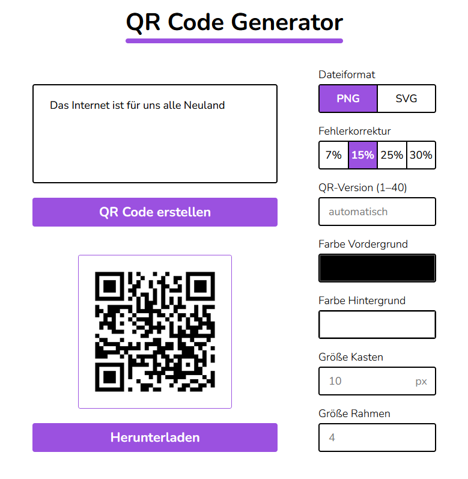
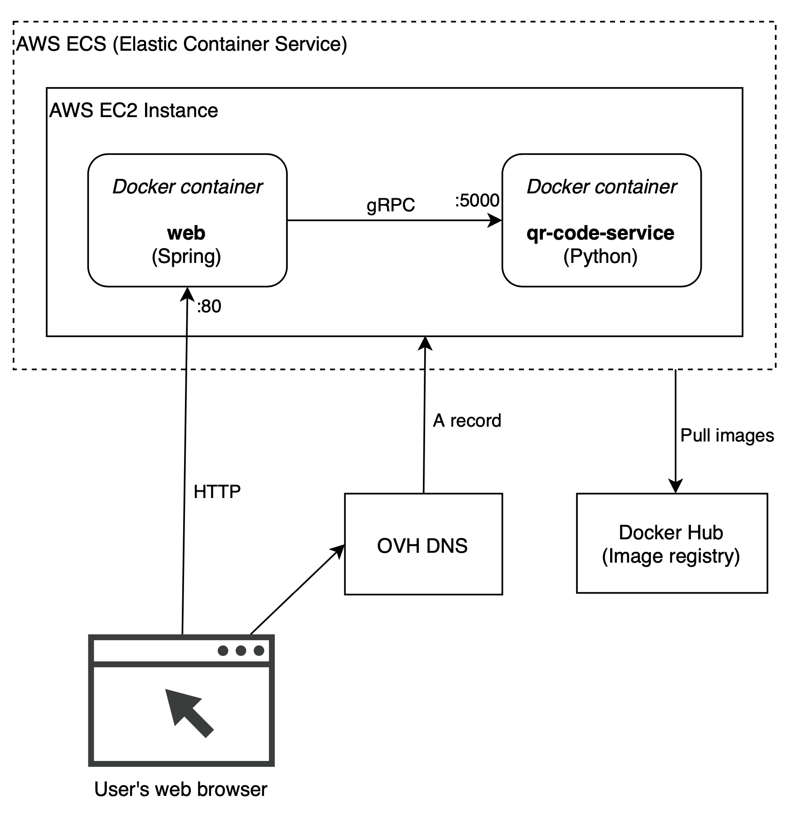

# Simple QR Code Generator - Translated to German



### Architecture



### Implementation details

_**qr-code-service**_ is a microservice implemented in Python which uses [qrcode](https://github.com/lincolnloop/python-qrcode) library.
It provides a gRPC interface for generating QR codes.

_**web**_ is a web application written in Spring and Kotlin. It uses Thymeleaf for server-side rendering.

Both services are dockerized.
Docker Compose configuration is used for deployment on AWS Elastic Container Service.

### UI Design

[Figma project](https://www.figma.com/file/m0zkjHTBtYOHYB327GsUou/QR_Code_Generator?node-id=0%3A1)

### How to Use

1. **Install Docker** if you haven't already.
2. **Clone the Repository and build the image** using the following commands:

```bash
git clone https://github.com/FlyingT/qr-code-generator-german.git
```
```bash
cd qr-code-generator-german
```
```bash
docker compose up --build -d
```
The Web-UI will be published on Port 3007, so go top http://[IP-of-Host]:3007 to access it


Ignore this, its just for reinstalling:
```bash
docker container stop qr-code-generator-german
docker container qr-code-generator-german
docker system prune
cd ..
rm -r  qr-code-generator-german
```
